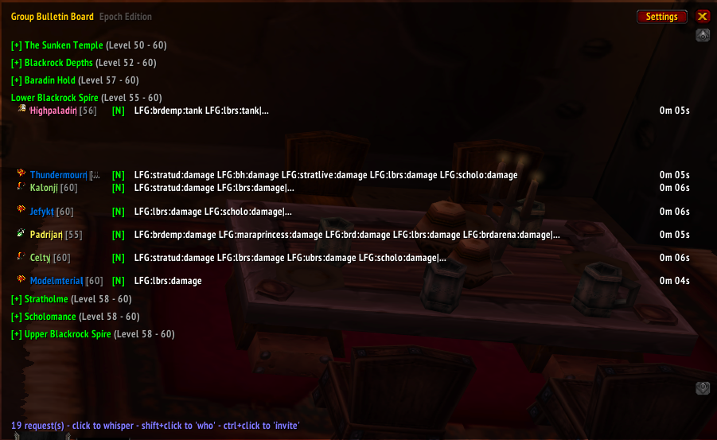
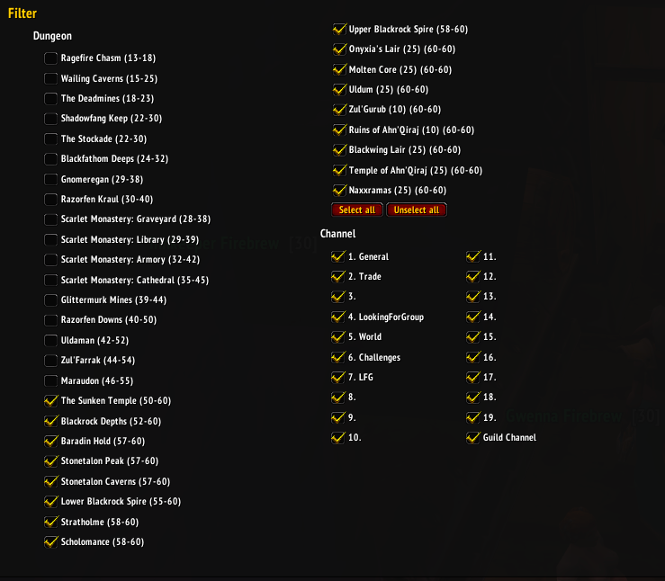

# GroupBulletinBoard

This is the Project Epoch version of the port to WotLK (3.3.5a) of a TBC backport of a Classic TBC addon!
(mouthful I know)

* This version: [eVen-gits](https://github.com/eVen-gits/GroupBulletinBoard)
* Epoch version: [TheNielDeal](https://github.com/TheNielDeal)
* WotLK (3.3.5a) port: [fondlez](https://github.com/fondlez)
* TBC 2.4.3 backport: [Obszczymucha aka. Ohhaimark](https://codeberg.org/obszczymucha/group-bulletin-board-tbc)
* Classic TBC addon: [Vyscî-Whitemane](https://github.com/Vysci/LFG-Bulletin-Board)
* Original addon: https://legacy.curseforge.com/wow/addons/group-bulletin-board

## Description
GroupBulletinBoard (GBB) provides an overview of the endless requests in the
chat channels. It detects all requests to the instances, sorts them and presents
them clearly way. Numerous filtering options reduce the gigantic number to
exactly the dungeons that interest you. And if that's not enough, GBB will let
you know about any new request via a sound or chat notification.

Currently, English, German, Russian and Chinese dungeons are recognized
natively. But it is easily possible to adapt GBB to any language.

To open the settings, use slash command: **`/gbb`** or click the minimap icon.

## Recent Improvements

### UI Enhancements
- **Fixed entry overlapping issues** - Improved height calculations and positioning to prevent entries from overlapping
- **Removed subcategory headers** - LFG and LFM entries now display directly under dungeon headers for a cleaner, more compact view
- **Removed Miscellaneous section** - No longer displays generic "Misc" entries that weren't useful
- **Removed Trade section** - Trade-related entries are no longer processed or displayed
- **Improved visual hierarchy** - Player entries are slightly indented for better visual separation

### Player Information
- **Enhanced /who integration** - Shift+click on any dungeon header to refresh class and level information for all players in that dungeon
- **Better class/level updates** - When player information is updated via /who, all entries for that player across all dungeons are updated simultaneously
- **Automatic player data refresh** - The addon now automatically attempts to gather class and level information for players

### Performance & Stability
- **Fixed column width calculations** - Prevents mid-render reflow that caused overlapping
- **Improved frame management** - Better cleanup of UI elements to prevent memory leaks
- **Enhanced error handling** - More robust handling of missing functions and data

## Graphical Interface

### Main Window

### Interface Settings

## Slash Commands

`<value>` can be true, 1, enable, false, 0, disable. If <value> is omitted, the
current status switches.

* `/gbb notify chat <value>` - On new request make a chat notification
* `/gbb notify sound <value>` - On new request make a sound notification
* `/gbb debug <value>` - Show debug information
* `/gbb reset` -  Reset main window position
* `/gbb config/setup/options` - Open configuration
* `/gbb about` - open about
* `/gbb help` - Print help
* `/gbb chat clean/organize` - Creates a new chat tab if one doesn't already
exist, named \"LFG\" with all channels subscribed. Removes LFG heavy spam
channels from default chat tab
* `/gbb` - open main window

## Credits

### Original Addon
* Arrogant_Dreamer, Hubbotu and kavarus for the Russian translation
* Baudzilla for the graphics/idea of the resize-code